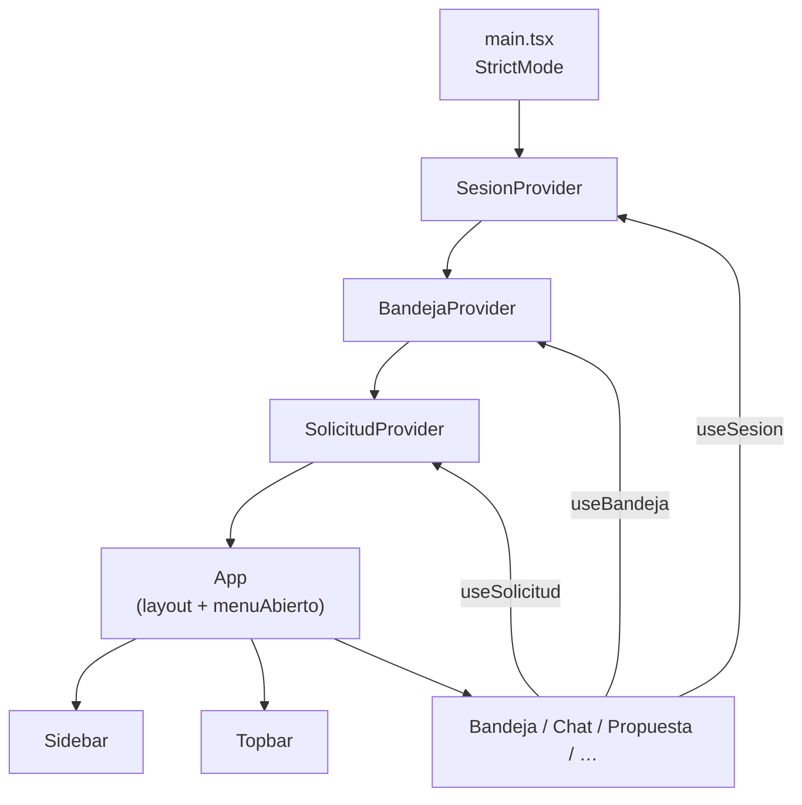

# Design Document — refactor-app-contextos

## Overview

`App.tsx` actualmente concentra más de 20 `useState`, todos los efectos de carga de datos
y más de 340 líneas de código. Este diseño describe la extracción de ese estado en tres
Contextos React especializados por dominio: `SesionContext`, `SolicitudContext` y
`BandejaContext`.

**Criterio de éxito más importante (negativo):** ningún test existente en `App.test.tsx`
puede romperse tras el refactor. El comportamiento observable para el usuario es idéntico.

### Objetivos del refactor

- Dividir las responsabilidades de `App.tsx` en unidades cohesivas y testeables de forma
  aislada.
- Que `App.tsx` quede como orquestador de layout (<150 líneas sin imports).
- Facilitar el crecimiento futuro: nuevas features agregan estado en el contexto correcto,
  no en `App.tsx`.

---

## Architecture

El árbol de providers envuelve a `App` en `main.tsx`. El orden de composición es:

```
SesionProvider
  └─ BandejaProvider        (depende de pantalla e irA de SesionContext)
       └─ SolicitudProvider (depende de empresa y irA de SesionContext)
            └─ App          (solo layout + menuAbierto)
```

`SesionProvider` va primero porque `BandejaContext` y `SolicitudContext` necesitan leer
`pantalla` e `irA` (navegación) y `empresa` (tenant activo).

### Diagrama de composición



---

## Components and Interfaces

### Estructura de archivos propuesta

```
apps/web/src/
├── contextos/
│   ├── SesionContext.tsx        ← SesionProvider + useSesion
│   ├── SolicitudContext.tsx     ← SolicitudProvider + useSolicitud
│   └── BandejaContext.tsx       ← BandejaProvider + useBandeja
├── App.tsx                      ← orquestador de layout (~120 líneas)
├── main.tsx                     ← añade los 3 providers
└── tipos.ts                     ← sin cambios
```

Los tres contextos viven bajo `contextos/`. Cada archivo exporta: la interfaz del valor,
el contexto raw (para mocks de test), el Provider y el hook de acceso rápido.

### Interfaces TypeScript

#### `SesionContext.tsx`

```typescript
import type { Empresa, Pantalla, Sesion } from '../tipos'

export interface SesionContextValor {
  // Estado de autenticación: undefined = aún resolviendo, null = sin sesión
  sesion: Sesion | null | undefined
  empresa: Empresa
  setEmpresa: (e: Empresa) => void
  cerrarSesion: () => Promise<void>
  // Navegación de layout (antes en App.tsx)
  pantalla: Pantalla
  irA: (p: Pantalla) => void
}
```

Responsabilidades del `SesionProvider`:
- `useEffect` → `supabase.auth.getSession()` + suscripción a `onAuthStateChange`.
- `useEffect([sesion])` → cuando sesión pasa a no nula, llama `obtenerEmpresa()`.
- `useEffect([empresa])` → actualiza `--brand` y `--brand-soft` en `document.documentElement`.

#### `SolicitudContext.tsx`

```typescript
import type {
  Componente, Fuente, Mensaje, Solicitud, Tarea, TipoConfirmado
} from '../tipos'
import type { RecursoDrive } from '../datosMock'

export interface SolicitudContextValor {
  solicitudActual: Solicitud | null
  tipo: TipoConfirmado
  mensajes: Mensaje[]
  componentes: Componente[]
  tareas: Tarea[]
  fuentes: Fuente[]
  enviando: boolean
  recursos: RecursoDrive[]
  // Acciones
  abrirSolicitud: (s: Solicitud) => void
  iniciarChat: (tipo: TipoConfirmado) => void
  enviarMensaje: (texto: string) => Promise<void>
  generarPropuesta: () => Promise<void>
  setTareas: (tareas: Tarea[]) => void
}
```

Responsabilidades del `SolicitudProvider`:
- `useEffect([empresa])` → carga `obtenerRecursosDrive()`.
- `iniciarChat` → limpia estado, pone intro de Javo, rehidrata historial y cotización en
  curso.
- `enviarMensaje` → agrega mensaje del usuario, llama `conversarConJavo`, actualiza estado.
- `generarPropuesta` → llama `guardarPropuesta` o `obtenerPropuesta`, luego `irA('propuesta')`.
  (Necesita `irA` de `SesionContext`; lo obtiene con `useSesion()` internamente.)

#### `BandejaContext.tsx`

```typescript
import type { Solicitud } from '../tipos'
import type { PropuestaResumen } from '../api/propuestas'

export interface BandejaContextValor {
  // Solicitudes
  solicitudes: Solicitud[]
  cargandoSolicitudes: boolean
  errorSolicitudes: boolean
  reintentoSolicitudes: number
  setReintentoSolicitudes: React.Dispatch<React.SetStateAction<number>>
  // Propuestas
  propuestas: PropuestaResumen[]
  cargandoPropuestas: boolean
  errorPropuestas: boolean
  reintentoPropuestas: number
  setReintentoPropuestas: React.Dispatch<React.SetStateAction<number>>
  // Tareas globales
  cargandoTareas: boolean
  errorTareas: boolean
  reintentoTareas: number
  setReintentoTareas: React.Dispatch<React.SetStateAction<number>>
  // Acciones
  abrirPropuestaDesdeLista: (solicitudId: string) => Promise<void>
}
```

Responsabilidades del `BandejaProvider`:
- `useEffect([empresa, estadoCorreo.proveedor, pantalla, reintentoSolicitudes])` →
  carga solicitudes + auto-refresh de 20 s cuando `pantalla === 'inbox'`.
- `useEffect([empresa, pantalla, reintentoPropuestas])` → carga propuestas cuando
  `pantalla === 'propuestas'`.
- `useEffect([empresa, pantalla, tareas.length, reintentoTareas])` → carga tareas globales
  cuando `pantalla === 'tareas'` y no hay tareas en `SolicitudContext`.
- Lee `pantalla`, `irA`, `empresa` de `useSesion()`; lee `tareas` y `setSolicitudActual`
  de `useSolicitud()`.

### Estado y props que permanecen en `App.tsx`

| Estado / prop | Por qué queda en App |
|---|---|
| `menuAbierto` / `setMenuAbierto` | Estado puramente visual; no lo necesita ningún otro componente |
| `onNavegar` (prop) | Inyectable para tests; conecta `iniciarConexionGmail` con la navegación |
| `estadoCorreo` / `setEstadoCorreo` / `cargandoCorreo` | Estado de integración que alimenta directamente a `<Configuracion>` y `<Bandeja>`; opcionalmente puede moverse a `BandejaContext` en un refactor posterior |
| `conectarProveedor` / `desconectarProveedor` | Usan `onNavegar`; permanecen en App o se mueven a `BandejaContext` |

> **Decisión de diseño:** `estadoCorreo` y las funciones de conexión se mantienen en
> `App.tsx` durante este refactor para minimizar el riesgo. Se pueden extraer a
> `BandejaContext` en una iteración posterior sin romper ningún test.

---

## Data Models

No hay cambios en modelos de datos. Los tipos en `tipos.ts` y `datosMock.ts` no se
modifican. Los contextos reutilizan exactamente los mismos tipos de datos.

### Flujo de datos entre contextos

```
SesionContext
  pantalla ──────────────────►  BandejaContext (decide cuándo cargar)
  empresa  ──────────────────►  BandejaContext (cambia el tenant)
  empresa  ──────────────────►  SolicitudContext (recarga recursos del Drive)
  irA      ──────────────────►  SolicitudContext (navega tras generarPropuesta)
  irA      ──────────────────►  BandejaContext (navega al abrir propuesta de lista)

SolicitudContext
  tareas   ──────────────────►  BandejaContext (decide si cargar tareas globales)
  setSolicitudActual ─────────►  BandejaContext (abrirPropuestaDesdeLista)
```

---

## Correctness Properties

*Una propiedad es una característica o comportamiento que debe mantenerse en todas las
ejecuciones válidas de un sistema — esencialmente, un enunciado formal sobre lo que el
sistema debe hacer. Las propiedades sirven de puente entre especificaciones legibles y
garantías de corrección verificables automáticamente.*

### Property 1: White-label reactivo

*Para cualquier* empresa con cualquier color de marca hexadecimal, cuando `SesionContext`
actualiza `empresa`, las variables CSS `--brand` y `--brand-soft` del elemento raíz deben
reflejar inmediatamente el color nuevo (`--brand === color` y
`--brand-soft === color + '22'`).

**Validates: Requirements 1.4, 7.5**

---

### Property 2: `iniciarChat` limpia y rehidrata para toda solicitud

*Para cualquier* solicitud (con id y remitente arbitrarios) y cualquier tipo confirmado
(`t1` o `t2`), cuando se llama `iniciarChat`:
- El estado de mensajes, componentes, tareas y fuentes queda limpio antes de la
  rehidratación.
- El primer mensaje en la lista contiene el `remitente` de la solicitud.
- Se invoca `obtenerHistorialConversacion` con el `id` exacto de la solicitud.
- Se invoca `obtenerCotizacionEnCurso` con el `id` exacto de la solicitud.

**Validates: Requirements 2.3, 7.6**

---

### Property 3: `enviarMensaje` agrega el mensaje y actualiza estado

*Para cualquier* string de texto de mensaje (incluyendo strings con caracteres especiales,
espacios o texto largo), cuando se llama `enviarMensaje(texto)`:
- La lista de mensajes contiene el mensaje del usuario con `rol: 'usuario'` y el `texto`
  enviado.
- Se llamó a `conversarConJavo` exactamente una vez.
- La lista de mensajes posterior contiene la respuesta de Javo.

**Validates: Requirements 2.4**

---

### Property 4: Carga reactiva de solicitudes para cualquier proveedor conectado

*Para cualquier* valor no nulo de `estadoCorreo.proveedor` (`'gmail'`, `'outlook'`,
`'imap'`), cuando `pantalla === 'inbox'`, el `BandejaProvider` debe llamar a
`obtenerSolicitudesOError` al menos una vez y, tras ~20 segundos, llamarla de nuevo
(auto-refresh).

**Validates: Requirements 3.2, 7.3**

---

### Property 5: Bandera de error activada ante cualquier fallo de carga

*Para cualquier* una de las tres cargas de datos (solicitudes, propuestas, tareas), si la
función de carga correspondiente rechaza con un error, la bandera de error asociada
(`errorSolicitudes`, `errorPropuestas`, `errorTareas`) debe pasar a `true` y las otras dos
banderas no deben verse afectadas.

**Validates: Requirements 3.6**

---

### Property 6: Reintento siempre dispara nueva carga

*Para cualquier* valor entero N en `reintentoSolicitudes`, `reintentoPropuestas` o
`reintentoTareas`, al incrementarlo a N+1 debe ejecutarse la carga correspondiente exactamente
una vez más (idempotencia del reintento).

**Validates: Requirements 3.7**

---

### Property 7: Providers aislados — montaje independiente

*Para cualquier* uno de los tres providers (`SesionProvider`, `SolicitudProvider`,
`BandejaProvider`), debe poder montarse en un test sin los otros dos, y el hook
correspondiente debe devolver un valor no nulo y del tipo correcto.

**Validates: Requirements 6.1, 6.3**

---

### Property 8: Navegación conserva el estado de los contextos

*Para cualquier* solicitud activa con componentes y mensajes cargados, al navegar de
`'chat'` a `'propuesta'` (y volver), el `SolicitudContext` debe mantener los mismos
componentes y mensajes sin pérdida de datos.

**Validates: Requirements 7.2**

---

### Property 9: Cambio de empresa reinicia bandeja y recarga datos del nuevo tenant

*Para cualquier* empresa nueva distinta de la empresa activa, cuando `SesionContext`
actualiza `empresa`, el `BandejaContext` debe:
1. Vaciar la lista de solicitudes.
2. Volver a llamar a las cargas de datos con el nuevo contexto de empresa.

**Validates: Requirements 7.4**


---

## Error Handling

### Errores de carga de datos

Los tres contextos siguen el mismo patrón de manejo de errores que existe hoy en
`App.tsx`:

1. `setCargando(true)` al inicio.
2. En el `.catch()`, se activa la bandera de error (`setError(true)`).
3. La bandera se limpia al inicio de cada nueva carga (incluyendo reintentos).
4. El componente receptor decide cómo mostrar el error (banner + botón "Reintentar").

### Errores de hooks usados fuera del Provider

Cada hook lanza un error descriptivo en español si se usa fuera de su Provider:

```typescript
// Ejemplo para useSesion
export function useSesion(): SesionContextValor {
  const ctx = useContext(SesionContext)
  if (ctx === undefined) {
    throw new Error('useSesion debe usarse dentro de SesionProvider')
  }
  return ctx
}
```

Los mensajes de error exactos:
- `"useSesion debe usarse dentro de SesionProvider"`
- `"useSolicitud debe usarse dentro de SolicitudProvider"`
- `"useBandeja debe usarse dentro de BandejaProvider"`

### Contextos con valor por defecto `undefined`

El valor inicial de cada contexto es `undefined` (no un valor vacío). Esto garantiza
que el hook detecte el caso de uso fuera del Provider y lance el error descriptivo.

```typescript
const SesionContext = createContext<SesionContextValor | undefined>(undefined)
```

---

## Migration Strategy

La migración se hace en tres iteraciones independientes, cada una terminada con
`npm test` en verde antes de avanzar.

### Iteración 1 — Extraer `SesionContext` (el más independiente)

1. Crear `src/contextos/SesionContext.tsx`.
2. Mover a `SesionProvider`: `sesion`, `empresa`, `setEmpresa`, `cerrarSesion`,
   `pantalla`, `irA`.
3. Mover los tres `useEffect` de sesión, empresa y white-label.
4. Envolver `App` con `SesionProvider` en `main.tsx`.
5. Reemplazar en `App.tsx` los estados y efectos movidos por llamadas a `useSesion()`.
6. Ejecutar `npm test` — todos los tests deben pasar.

**Por qué primero:** no depende de ningún otro contexto; es el proveedor de dependencias
para los otros dos.

### Iteración 2 — Extraer `SolicitudContext`

1. Crear `src/contextos/SolicitudContext.tsx`.
2. Mover: `solicitudActual`, `tipo`, `mensajes`, `componentes`, `tareas`, `fuentes`,
   `enviando`, `recursos`.
3. Mover: `abrirSolicitud`, `iniciarChat`, `enviarMensaje`, `generarPropuesta`.
4. Mover el `useEffect` de recursos del Drive.
5. `SolicitudProvider` usa `useSesion()` para obtener `empresa`, `irA`.
6. Envolver con `SolicitudProvider` en `main.tsx` (dentro de `SesionProvider`).
7. Actualizar `App.tsx` para usar `useSolicitud()`.
8. Ejecutar `npm test` — todos los tests deben pasar.

### Iteración 3 — Extraer `BandejaContext`

1. Crear `src/contextos/BandejaContext.tsx`.
2. Mover: `solicitudes`, estados de carga/error/reintento de solicitudes, propuestas y
   tareas globales; `abrirPropuestaDesdeLista`.
3. Mover los tres `useEffect` de carga de datos (con el auto-refresh de solicitudes).
4. `BandejaProvider` usa `useSesion()` (para `pantalla`, `empresa`, `irA`) y
   `useSolicitud()` (para `tareas.length`, `setSolicitudActual`).
5. Envolver con `BandejaProvider` en `main.tsx` (entre `SesionProvider` y
   `SolicitudProvider`).
6. Actualizar `App.tsx` para usar `useBandeja()`.
7. Ejecutar `npm test` — todos los tests deben pasar.

### Cómo queda `main.tsx` al final

```tsx
createRoot(document.getElementById('root')!).render(
  <StrictMode>
    <SesionProvider>
      <BandejaProvider>
        <SolicitudProvider>
          <App />
        </SolicitudProvider>
      </BandejaProvider>
    </SesionProvider>
  </StrictMode>
)
```

### Cómo queda `App.tsx` al final (esqueleto)

```tsx
function App({ onNavegar = (url) => window.location.assign(url) }: AppProps = {}) {
  const { sesion, pantalla, empresa } = useSesion()
  const { solicitudActual, iniciarChat, enviarMensaje, generarPropuesta } = useSolicitud()
  const { solicitudes, cargandoSolicitudes, errorSolicitudes, setReintentoSolicitudes,
          propuestas, cargandoPropuestas, errorPropuestas, setReintentoPropuestas,
          cargandoTareas, errorTareas, setReintentoTareas, abrirPropuestaDesdeLista } = useBandeja()

  // Estado estrictamente local de UI
  const [menuAbierto, setMenuAbierto] = useState(false)
  // Integración de correo (puede moverse a BandejaContext en refactor posterior)
  const [estadoCorreo, setEstadoCorreo] = useState<EstadoCorreo>(ESTADO_DESCONECTADO)
  const [cargandoCorreo, setCargandoCorreo] = useState(true)

  // ... efectos de carga de estadoCorreo ...
  // ... funciones conectarProveedor / desconectarProveedor (usan onNavegar) ...

  if (sesion === undefined) return null
  if (!sesion) return <Login onEntrar={() => {}} />

  return (
    <div className="app">
      <Sidebar ... />
      <div className={'scrim' + (menuAbierto ? ' show' : '')} ... />
      <div className="main">
        <Topbar ... />
        <div className="scroll">
          {pantalla === 'configuracion' && <Configuracion ... />}
          {pantalla === 'inbox' && <Bandeja ... />}
          {pantalla === 'detail' && <DetalleSolicitud ... />}
          {pantalla === 'chat' && <Chat ... />}
          {pantalla === 'propuestas' && <PropuestasLista ... />}
          {pantalla === 'propuesta' && <Propuesta ... />}
          {pantalla === 'tareas' && <Tareas ... />}
        </div>
      </div>
    </div>
  )
}
```

---

## Testing Strategy

### Enfoque dual

Este refactor aplica una estrategia **dual**: tests de ejemplo + tests de propiedades.

- **Tests de ejemplo** (unitarios con vitest + @testing-library/react): verifican
  comportamientos específicos, inicialización y edge cases.
- **Tests de propiedad** (property-based con `fast-check`): verifican invariantes
  universales que deben valer para cualquier input.

### Librería de property-based testing

Se usará **[fast-check](https://fast-check.dev)** (compatible con vitest, sin dependencias
adicionales). Instalación:

```bash
npm install --save-dev fast-check
```

Cada property test se ejecuta con mínimo **100 iteraciones** por defecto (valor predeterminado
de fast-check).

### Archivos de test propuestos

```
src/contextos/
├── SesionContext.test.tsx
├── SolicitudContext.test.tsx
└── BandejaContext.test.tsx
```

### Patrón de test de contexto aislado

Para probar cada contexto de forma independiente se usa un componente auxiliar:

```tsx
// Helper reutilizable para tests de contexto
function ComponentePrueba<T>({
  useHook,
  onValor,
}: {
  useHook: () => T
  onValor: (v: T) => void
}) {
  const valor = useHook()
  onValor(valor)
  return null
}
```

Ejemplo de test de propiedad para `SesionContext`:

```tsx
import * as fc from 'fast-check'
import { render, act } from '@testing-library/react'
import { SesionProvider, useSesion } from './SesionContext'

// Feature: refactor-app-contextos, Property 1: white-label reactivo
it('Property 1: --brand y --brand-soft reflejan cualquier color de empresa', () => {
  fc.assert(
    fc.property(
      // Genera colores hex de 6 dígitos arbitrarios
      fc.hexaString({ minLength: 6, maxLength: 6 }).map((h) => '#' + h),
      (color) => {
        const empresa = { nombre: 'Test', color, marca: 'T' }
        let setter: (e: typeof empresa) => void = () => {}
        const Consumidor = () => {
          const ctx = useSesion()
          setter = ctx.setEmpresa
          return null
        }
        render(<SesionProvider><Consumidor /></SesionProvider>)
        act(() => setter(empresa))
        const raiz = document.documentElement
        expect(raiz.style.getPropertyValue('--brand')).toBe(color)
        expect(raiz.style.getPropertyValue('--brand-soft')).toBe(color + '22')
      }
    )
  )
})
```

### Tests de ejemplo y edge cases

Cada archivo de test de contexto cubre:

1. **Inicialización correcta** — el hook devuelve todas las propiedades esperadas.
2. **Edge case: uso fuera del provider** — el hook lanza el error descriptivo.
3. **Comportamientos reactivos específicos** — ej. sesión activa dispara `obtenerEmpresa`.

### Compatibilidad con `App.test.tsx` existente

La suite existente **no se modifica**. Es el indicador de regresión principal. Cada
iteración del refactor termina con `npm test` en verde.

Para que los mocks de `App.test.tsx` sigan funcionando, `vi.mock('./supabase/cliente', ...)`
se ejecuta en el ámbito del test antes de que se monte cualquier Provider. Los providers
usan `supabase.auth` internamente, que al estar mockeado responde igual que antes.

### Cobertura objetivo

| Contexto | Tests de ejemplo | Tests de propiedad |
|---|---|---|
| `SesionContext` | 3 (init, sesión, empresa) | 1 (Property 1) |
| `SolicitudContext` | 3 (init, generarPropuesta, edge case) | 2 (Properties 2 y 3) |
| `BandejaContext` | 3 (propuestas, tareas, edge case) | 4 (Properties 4, 5, 6, 9) |
| Independencia de providers | — | 1 (Property 7) |
| Navegación conserva estado | — | 1 (Property 8) |
| App.test.tsx (existente) | 12 tests (sin tocar) | — |
